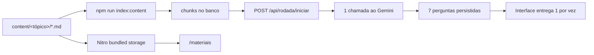

# Quiz Data & AI

Aplicação interna de aprendizado que transforma apostilas em Markdown em duas experiências complementares:

- uma gincana com rodadas de 7 perguntas geradas por IA, pontuação por dificuldade e agilidade, histórico e ranking acumulado;
- uma biblioteca pública para consultar os mesmos materiais de estudo diretamente no navegador.

O projeto reúne frontend, API e renderização SSR em uma aplicação Nuxt. O banco usa SQLite local durante o desenvolvimento e Turso em produção, ambos pelo mesmo driver libSQL.


## Sumário

- [O que a ferramenta faz](#o-que-a-ferramenta-faz)
- [Como o sistema funciona](#como-o-sistema-funciona)
- [Stack](#stack)
- [Início rápido](#início-rápido)
- [Configuração](#configuração)
- [Materiais de estudo](#materiais-de-estudo)
- [Banco de dados](#banco-de-dados)
- [Regras da gincana](#regras-da-gincana)
- [Rotas e API](#rotas-e-api)
- [Scripts](#scripts)
- [Validação e testes](#validação-e-testes)
- [Deploy em produção](#deploy-em-produção)
- [Segurança e privacidade](#segurança-e-privacidade)
- [Solução de problemas](#solução-de-problemas)
- [Estrutura do projeto](#estrutura-do-projeto)
- [Documentação de referência](#documentação-de-referência)

## O que a ferramenta faz

O fluxo principal começa com a entrada por e-mail corporativo. Depois de criar a sessão, o jogador pode selecionar um ou vários tópicos e iniciar quantas rodadas quiser. Cada rodada contém exatamente 7 perguntas, distribuídas em 2 fáceis, 3 médias e 2 difíceis.

As perguntas são preparadas de uma só vez no início da rodada. O servidor seleciona 7 trechos distintos das apostilas, chama o modelo uma única vez e valida integralmente a resposta antes de persistir a rodada. A interface entrega uma pergunta por vez, sem enviar o gabarito antecipadamente.

Além do jogo, `/materiais` oferece um catálogo público das apostilas. O leitor converte Markdown em HTML, cria um sumário a partir dos títulos, estima o tempo de leitura e permite navegar por tópico ou pesquisar por título.

Principais recursos:

- login simplificado por e-mail `@---.com.br`;
- escolha de um tópico, vários tópicos ou todos os tópicos disponíveis;
- geração de perguntas fundamentadas exclusivamente nos materiais indexados;
- fallback para perguntas já validadas quando o LLM falha ou excede o tempo limite;
- pontuação calculada no servidor;
- retomada de uma rodada em andamento;
- encerramento automático de rodadas abandonadas;
- histórico individual e ranking geral acumulado;
- reporte de perguntas problemáticas;
- catálogo e leitor público dos arquivos Markdown;
- suporte a SQLite local e Turso sem trocar o código da aplicação.

## Como o sistema funciona



Os arquivos em `content/` têm dois destinos:

1. **Quiz:** `npm run index:content` divide o texto em chunks e os sincroniza com o banco. Esses chunks alimentam o sorteio e a geração de perguntas.
2. **Leitor:** o build do Nuxt empacota os arquivos em um storage do Nitro. As rotas públicas de materiais leem esse bundle e renderizam o Markdown sob demanda.

Essa separação tem uma consequência operacional: editar uma apostila exige nova indexação para atualizar o quiz e novo build/deploy para atualizar o leitor em produção.

## Stack

| Camada | Tecnologia | Responsabilidade |
|---|---|---|
| Aplicação | Nuxt 4 | SSR, páginas Vue e endpoints Nitro no mesmo projeto |
| Interface | Vue 3 + TypeScript | Componentes e estado da experiência do usuário |
| Estilo | Tailwind CSS | Layout responsivo e identidade visual |
| Banco | SQLite local / Turso | Persistência de usuários, conteúdo, perguntas e rodadas |
| ORM | Drizzle ORM | Schema, consultas e migrations |
| Sessão | `nuxt-auth-utils` | Cookie de sessão HTTP-only assinado |
| LLM | Google Generative Language API | Geração estruturada das 7 perguntas |
| Markdown | `markdown-it` | Renderização segura dos materiais de estudo |
| Animação | AOS | Animações progressivas, respeitando movimento reduzido |
| Hospedagem | Vercel | Alvo principal de produção |
| Pacotes | npm | Instalação e execução dos scripts |

A stack e as convenções obrigatórias estão em [.agents/AGENTS.md](.agents/AGENTS.md).

## Início rápido

### Pré-requisitos

- Node.js 20 ou superior;
- npm;
- Git;
- uma chave do Google AI Studio para testar a geração real de perguntas;
- acesso a um banco Turso somente se for trabalhar com um ambiente remoto.

O desenvolvimento comum não exige instalação do SQLite nem da CLI do Turso. O driver cria e acessa o arquivo local configurado em `TURSO_DATABASE_URL`.

### 1. Clone e instale

```sh
git clone <url-do-repositorio>
cd quiz_data_ai
npm install
```

### 2. Crie o arquivo de ambiente

Em macOS, Linux ou WSL:

```sh
cp .env.example .env
```

No PowerShell:

```powershell
Copy-Item .env.example .env
```

Gere um segredo de sessão com pelo menos 32 caracteres:

```sh
node -e "console.log(require('crypto').randomBytes(32).toString('hex'))"
```

Copie a saída para `SESSION_SECRET` no `.env`.

### 3. Prepare o banco e o conteúdo

```sh
npm run db:push
npm run index:content
```

`db:push` cria ou atualiza o schema no banco configurado. `index:content` lê as apostilas e popula a tabela `chunks`; ele não chama o LLM.

### 4. Inicie a aplicação

```sh
npm run dev
```

Acesse [http://localhost:3000](http://localhost:3000). Entre com um e-mail no domínio `@---.com.br`.

No Windows com a execução de scripts do PowerShell bloqueada, use `npm.cmd` no lugar de `npm`, por exemplo `npm.cmd run dev`.

## Configuração

A aplicação carrega estas variáveis do arquivo `.env` no desenvolvimento e do provedor de hospedagem em produção:

| Variável | Obrigatória | Padrão | Uso |
|---|---:|---|---|
| `TURSO_DATABASE_URL` | Sim em produção | `file:./.data/dev.db` | URL do SQLite local ou do banco Turso |
| `TURSO_AUTH_TOKEN` | Somente no Turso | vazio | Token de autenticação do banco remoto |
| `LLM_API_KEY` | Para geração real | vazio | Chave enviada pelo servidor à API do Google |
| `LLM_MODEL` | Não | `gemini-3.1-flash-lite` | Modelo usado na geração das perguntas |
| `SESSION_SECRET` | Sim | vazio | Assina e cifra a sessão; use no mínimo 32 caracteres |
| `GAME_TIMEZONE` | Não | `America/Sao_Paulo` | Define a data-calendário registrada no histórico |

Exemplo para desenvolvimento:

```dotenv
TURSO_DATABASE_URL=file:./.data/dev.db
TURSO_AUTH_TOKEN=
LLM_API_KEY=
LLM_MODEL=gemini-3.1-flash-lite
SESSION_SECRET=cole-aqui-um-segredo-longo-e-aleatorio
GAME_TIMEZONE=America/Sao_Paulo
```

O `.env` não deve ser commitado. A chave do LLM e o token do Turso são usados somente no servidor e não pertencem ao `runtimeConfig.public`.

### Desenvolvimento sem chave do LLM

É possível subir a aplicação sem `LLM_API_KEY`, mas uma rodada só poderá começar se o banco já contiver perguntas válidas de rodadas anteriores para o fallback. Em um banco novo, use uma chave ao menos para gerar o primeiro conjunto ou execute somente os checks simulados.

## Materiais de estudo

### Organização dos arquivos

Todo material deve seguir esta estrutura:

```text
content/
  <nome-do-topico>/
    <apostila>.md
```

Exemplo:

```text
content/
  DataBricks/
    databricks.md
  MDM/
    mdm.md
```

Regras importantes:

- o nome da pasta imediatamente abaixo de `content/` é a fonte de verdade do tópico;
- não há frontmatter nem cadastro paralelo de tópicos;
- arquivos Markdown soltos na raiz de `content/` são ignorados pela indexação;
- subpastas dentro de um tópico também são ignoradas;
- arquivos removidos ou trechos alterados são desativados por soft delete para preservar o histórico;
- é necessário ter ao menos 7 chunks ativos no conjunto de tópicos selecionado para iniciar uma rodada;
- para reduzir repetições, recomenda-se manter 30 ou mais chunks por tópico.

### Como escrever uma apostila

Use um único `# Título` como nome principal do documento e `## Seções` para separar conceitos. A indexação usa títulos de nível 2 como fronteiras naturais de chunks. Seções muito grandes são subdivididas por parágrafos e limites de palavras; partes com menos de 200 caracteres são descartadas.

Exemplo mínimo:

```md
# Fundamentos de MDM

## Registro dourado

Texto explicando o conceito, o contexto, exemplos e diferenças relevantes...

## Qualidade de dados

Texto suficiente para formar outro trecho independente de estudo...
```

Para gerar boas perguntas, cada seção deve explicar conceitos de forma autocontida. Evite depender apenas de imagens, links externos ou referências vagas a capítulos anteriores.

### Indexação do quiz

Depois de criar, editar, mover ou remover um Markdown, execute:

```sh
npm run index:content
```

O indexador:

1. descobre os arquivos em `content/<topico>/*.md`;
2. normaliza espaços e quebras de linha;
3. separa o conteúdo por títulos `##`;
4. divide seções grandes em blocos menores;
5. descarta blocos com menos de 200 caracteres;
6. calcula um hash SHA-256 do conteúdo;
7. cria, mantém, reativa ou desativa chunks dentro de uma transação.

A operação é idempotente: executar o comando outra vez sem alterações não duplica chunks e não reinicia `times_used`. O resumo impresso no terminal mostra, por tópico, quantos arquivos e chunks foram processados.

### Biblioteca pública

O catálogo fica em `/materiais` e não exige sessão. Cada documento recebe uma URL derivada do tópico e do nome do arquivo. O primeiro `# Título` vira o título da página; se estiver ausente, o nome do arquivo é usado.

O leitor:

- estima a duração com base em 220 palavras por minuto;
- monta o sumário com títulos `h1`, `h2` e `h3`;
- gera IDs únicos para navegação interna;
- abre links HTTP externos em uma nova aba com `noopener noreferrer`;
- desabilita HTML bruto no Markdown.

Em desenvolvimento, reinicie o servidor se um arquivo novo ou renomeado não aparecer no catálogo, pois o catálogo é mantido em cache durante a vida do processo. Em produção, gere e publique um novo build.

## Banco de dados

### Ambientes

O mesmo código usa `@libsql/client` nos dois ambientes:

- **local:** `file:./.data/dev.db`, sem token;
- **produção:** uma URL `libsql://...` e o token correspondente do Turso.

### Modelo de dados

| Tabela | Finalidade |
|---|---|
| `users` | Usuários identificados por e-mail e nome derivado do endereço |
| `chunks` | Trechos indexados dos materiais, uso acumulado e estado ativo |
| `questions` | Perguntas geradas ou reaproveitadas, gabarito, origem e reportes |
| `seen_chunks` | Histórico de exposição de cada usuário aos chunks |
| `rounds` | Estado, tópicos, placar e datas de cada rodada |
| `round_questions` | Ordem, resposta, tempo servido, pontos e reporte dentro da rodada |

Há um índice único parcial que impede duas rodadas em andamento para o mesmo usuário. Relações históricas são preservadas com desativação lógica, em vez de apagar chunks ou perguntas referenciadas.

### Alterações de schema

Edite [server/db/schema.ts](server/db/schema.ts), gere a migration e revise o SQL criado:

```sh
npm run db:generate
```

Para aplicar diretamente o schema ao banco configurado:

```sh
npm run db:push
```

Faça uma alteração de schema por vez e versione a migration em `server/db/migrations/`. Antes de executar comandos contra produção, confira o valor de `TURSO_DATABASE_URL` para evitar atualizar o banco errado.

Para testar somente a conexão:

```sh
npm run db:check
```

## Regras da gincana

### Preparação da rodada

Cada rodada usa 7 chunks distintos. O sorteio começa excluindo os chunks vistos pelo jogador nos últimos 7 dias; se restarem menos de 7, a janela cai para 3 dias e, por fim, a exclusão temporal é removida. Entre os candidatos, chunks menos usados recebem peso maior segundo `1 / (1 + times_used)`.

O servidor chama o LLM exatamente uma vez com os 7 trechos já escolhidos. A saída precisa conter:

- exatamente 7 perguntas;
- dificuldades na ordem `fácil, fácil, média, média, média, difícil, difícil`;
- 4 alternativas textuais e distintas por pergunta;
- um único índice correto entre 0 e 3;
- enunciado e explicação com pelo menos 20 caracteres.

Se a chamada falhar, exceder 20 segundos ou produzir uma resposta inválida, o gerador tenta montar a rodada com perguntas ativas já persistidas. Esse fallback também exige 7 chunks distintos e a distribuição 2/3/2. Se nenhuma estratégia puder preparar a rodada, a transação é revertida e nenhum estado parcial é gravado.

### Ciclo da rodada

- apenas uma rodada pode ficar em andamento por usuário;
- iniciar outra rodada enquanto uma está aberta devolve a rodada existente;
- as perguntas são entregues em sequência;
- o gabarito de uma pergunta só é devolvido depois que a resposta é registrada;
- o tempo mostrado é referência para o bônus e não bloqueia uma resposta tardia;
- uma rodada aberta há mais de 10 minutos é encerrada automaticamente com a pontuação parcial na próxima consulta relevante;
- não há limite diário de tentativas.

### Pontuação

| Dificuldade | Pontos base | Tempo de referência | Máximo com bônus |
|---|---:|---:|---:|
| Fácil | 100 | 25 s | 200 |
| Média | 200 | 35 s | 400 |
| Difícil | 300 | 45 s | 600 |

Uma resposta errada vale zero. Para um acerto, o servidor calcula:

```text
fator = max(0, (tempo_limite - tempo_decorrido) / tempo_limite)
pontos = round(pontos_base × (1 + fator))
```

O relógio começa quando o servidor entrega a pergunta. Valores de tempo enviados pelo navegador são ignorados. Depois do tempo de referência, o acerto continua valendo a pontuação base.

### Ranking e histórico

O ranking soma todas as rodadas concluídas. A ordem de desempate é:

1. maior total de pontos;
2. menos dias jogados;
3. menos rodadas jogadas;
4. primeira rodada mais antiga.

O histórico exibe somente rodadas encerradas. `GAME_TIMEZONE` determina o dia-calendário usado na contagem de dias jogados, mas não limita tentativas.

### Reporte de perguntas

O jogador pode reportar uma pergunta somente depois de respondê-la e apenas uma vez. Ao alcançar 3 reportes, a pergunta é desativada e deixa de participar do fallback. O registro permanece no banco para manter resultados antigos consistentes.

## Rotas e API

### Páginas

| Rota | Sessão | Descrição |
|---|---:|---|
| `/` | Não | Landing page, entrada por e-mail e ranking do usuário autenticado |
| `/materiais` | Não | Catálogo público de materiais |
| `/materiais/:slug` | Não | Leitor de uma apostila |
| `/jogar` | Sim | Seleção de tópicos e retomada de rodada |
| `/jogar/:roundId` | Sim | Execução da rodada |
| `/resultado/:roundId` | Sim | Resultado, gabarito e posição no ranking |
| `/historico` | Sim | Rodadas concluídas pelo usuário |

As rotas protegidas redirecionam usuários sem sessão para `/`.

### Endpoints

| Método | Endpoint | Sessão | Descrição |
|---|---|---:|---|
| `GET` | `/api/_health` | Não | Testa o banco somente em desenvolvimento; responde 404 em produção |
| `POST` | `/api/entrar` | Não | Cria ou recupera usuário e inicia a sessão |
| `GET` | `/api/materiais` | Não | Lista o catálogo público |
| `GET` | `/api/materiais/:slug` | Não | Retorna conteúdo renderizado e sumário |
| `GET` | `/api/topicos` | Sim | Lista tópicos com chunks ativos |
| `GET` | `/api/rodada/atual` | Sim | Retoma a rodada em andamento, se existir |
| `POST` | `/api/rodada/iniciar` | Sim | Prepara e inicia uma rodada |
| `GET` | `/api/rodada/:roundId/pergunta` | Sim | Entrega a próxima pergunta não respondida |
| `POST` | `/api/rodada/:roundId/responder` | Sim | Registra uma resposta e calcula os pontos |
| `POST` | `/api/rodada/:roundId/finalizar` | Sim | Encerra a rodada de forma idempotente |
| `GET` | `/api/rodada/:roundId/resultado` | Sim | Retorna o resultado depois do encerramento |
| `POST` | `/api/perguntas/:id/reportar` | Sim | Reporta uma pergunta já respondida |
| `GET` | `/api/ranking` | Sim | Retorna ranking paginado e posição do usuário |
| `GET` | `/api/historico` | Sim | Retorna o histórico do usuário |

Os endpoints de rodada verificam se a rodada pertence ao usuário da sessão. Erros de validação usam, em geral, HTTP 422; conflitos de estado, HTTP 409; recursos ausentes, HTTP 404.

### Exemplos de payload

Entrada:

```json
{
  "email": "nome.sobrenome@---.com.br"
}
```

Início com um tópico:

```json
{
  "topico": "MDM"
}
```

Início com vários tópicos:

```json
{
  "topicos": ["MDM", "DataBricks"]
}
```

Um corpo vazio em `/api/rodada/iniciar` usa todos os tópicos. Não envie `topico` e `topicos` juntos.

Resposta a uma pergunta:

```json
{
  "question_id": "uuid-da-pergunta",
  "chosen_index": 2
}
```

Paginação do ranking:

```text
GET /api/ranking?limit=20&offset=0
```

O limite máximo é 50. Os tipos compartilhados que descrevem os contratos estão em `shared/types/`.

## Scripts

| Comando | O que faz | Usa LLM |
|---|---|---:|
| `npm run dev` | Inicia Nuxt e Nitro em modo de desenvolvimento | Não por si só |
| `npm run build` | Gera o bundle de produção em `.output/` | Não |
| `npm run preview` | Serve localmente o bundle de produção | Não |
| `npm run postinstall` | Prepara tipos e artefatos internos do Nuxt; roda após a instalação | Não |
| `npm run index:content` | Sincroniza as apostilas com a tabela `chunks` | Não |
| `npm run questions:check` | Executa cenários simulados do gerador em memória | Não |
| `npm run questions:check -- --live` | Executa um cenário real com o modelo configurado | Sim |
| `npm run db:check` | Executa uma consulta simples para validar a conexão | Não |
| `npm run db:backfill-names` | Recalcula nomes de exibição a partir dos e-mails existentes | Não |
| `npm run db:generate` | Gera migration a partir do schema Drizzle | Não |
| `npm run db:push` | Aplica o schema ao banco configurado | Não |

## Validação e testes

O projeto não adota um framework geral de testes. O principal conjunto automatizado cobre o algoritmo crítico de preparação das perguntas:

```sh
npm run questions:check
```

Esse comando usa bancos SQLite em memória e transportes simulados. Ele verifica, entre outros cenários, o contrato das 7 perguntas, a única chamada ao modelo, janelas antirrepetição, ponderação, rollback transacional, fallback e seleção de vários tópicos.

Para validar o bundle inteiro:

```sh
npm run build
```

Para testar a integração real com o modelo e o banco configurados:

```sh
npm run questions:check -- --live
```

O modo `--live` consome a API e requer `LLM_API_KEY`, schema aplicado e material indexado.

Checklist manual recomendado antes de publicar:

- entrar com um e-mail corporativo e confirmar a persistência da sessão;
- iniciar uma rodada com um tópico e outra com vários tópicos;
- responder as 7 perguntas e conferir pontuação e resultado;
- atualizar a página durante uma rodada e confirmar a retomada;
- conferir histórico e ranking;
- reportar uma pergunta respondida;
- abrir `/materiais`, pesquisar, filtrar e navegar pelo sumário;
- testar as telas em largura móvel e com preferência por movimento reduzido.

## Deploy em produção

O alvo principal é a Vercel com Turso. O fluxo recomendado é:

1. crie ou escolha o banco Turso de produção;
2. configure localmente `TURSO_DATABASE_URL` e `TURSO_AUTH_TOKEN` para esse banco;
3. aplique o schema com `npm run db:push`;
4. carregue as apostilas com `npm run index:content`;
5. configure na Vercel todas as variáveis descritas em [Configuração](#configuração);
6. conecte o repositório e deixe a Vercel executar `npm run build`;
7. valide login, geração real, fallback, materiais, histórico e ranking no domínio publicado.

Use valores distintos de `SESSION_SECRET` entre desenvolvimento e produção. A URL do banco, o token e a chave do LLM devem ficar somente nas variáveis protegidas do projeto na Vercel.

Antes de liberar o sistema, confirme que o ambiente serverless aceita o tempo máximo de 20 segundos da chamada ao LLM e que cada tópico publicado possui pelo menos 7 chunks ativos. O ideal operacional é 30 ou mais chunks por tópico.

As apostilas do leitor são incorporadas ao bundle. Toda atualização em `content/` requer nova indexação contra o banco de produção e novo deploy da aplicação.

Consulte [docs/SPECs/T11-deploy.md](docs/SPECs/T11-deploy.md) para os critérios de aceite do deploy.

## Segurança e privacidade

- a sessão fica em cookie HTTP-only assinado por `nuxt-auth-utils`;
- a aplicação armazena o e-mail corporativo, o nome derivado do endereço e o histórico de jogo;
- não há senha, OAuth, SSO ou confirmação por e-mail;
- endpoints protegidos exigem sessão e validam a propriedade das rodadas;
- o servidor mede o tempo e calcula a pontuação;
- o gabarito completo só fica disponível depois do encerramento;
- HTML bruto em Markdown é desabilitado;
- links externos no leitor recebem `rel="noopener noreferrer"`;
- segredos permanecem no runtime privado do servidor.

Se a aplicação for exposta fora do ambiente interno, substitua o login simplificado por um provedor corporativo com verificação de identidade antes de considerar o sistema adequado para dados sensíveis ou premiações formais.

## Solução de problemas

### A aplicação reclama do segredo de sessão

Confirme que `SESSION_SECRET` existe no `.env` e possui pelo menos 32 caracteres. Reinicie o servidor depois da alteração.

### Nenhum tópico aparece

Execute, nesta ordem:

```sh
npm run db:push
npm run index:content
npm run db:check
```

A lista de tópicos vem dos chunks ativos no banco, não diretamente das pastas.

### “Material insuficiente” ao iniciar uma rodada

O conjunto selecionado precisa fornecer 7 chunks ativos distintos. Verifique o resumo de `npm run index:content`; seções muito curtas são descartadas. Acrescente conteúdo, escolha mais tópicos ou divida a apostila em seções `##` mais completas.

### A geração falha e nenhuma rodada é criada

Confira `LLM_API_KEY`, `LLM_MODEL`, conectividade e os logs do servidor. Em um banco novo, o fallback ainda não possui perguntas anteriores para reaproveitar. A falha não deixa rodada incompleta nem registra uso dos chunks.

### O conteúdo do quiz mudou, mas as perguntas continuam antigas

Rode `npm run index:content` no mesmo banco usado pela aplicação. A indexação desativa chunks antigos; perguntas já armazenadas permanecem para preservar o histórico, mas só perguntas e chunks ativos entram no fallback.

### O leitor de materiais não mostra uma alteração

No desenvolvimento, reinicie `npm run dev` se necessário. Em produção, faça um novo build/deploy, porque os Markdown são empacotados pelo Nitro.

### O banco local não abre

Use uma URL relativa válida, por exemplo `file:./.data/dev.db`, e confirme que o processo pode gravar no diretório do projeto. Depois execute `npm run db:check`.

### O PowerShell bloqueia o comando `npm`

Use o executável `npm.cmd`, por exemplo:

```powershell
npm.cmd install
npm.cmd run dev
```

### Uma rodada antiga impede o início de outra

Rodadas abertas por mais de 10 minutos são encerradas na próxima consulta relevante. Dentro dessa janela, a aplicação retoma a rodada existente por design.

## Estrutura do projeto

```text
app/
  assets/             estilos e recursos visuais
  components/         componentes reutilizáveis e componentes de domínio
  composables/        estado e comportamentos compartilhados no cliente
  layouts/            shell, cabeçalho e navegação
  middleware/         proteção das rotas autenticadas
  pages/              páginas e rotas da aplicação
  plugins/            integrações executadas pelo Nuxt
content/
  <topico>/            apostilas Markdown; nome da pasta define o tópico
docs/
  SPECs/               especificação funcional e tarefas implementadas
  brand/               fonte de verdade da identidade visual
scripts/               indexação, checks e rotinas operacionais
server/
  api/                 endpoints Nitro
  db/                  schema Drizzle, cliente e migrations
  services/            geração, sorteio, pontuação e ranking
  utils/               acesso, ciclo da rodada e leitura dos materiais
shared/
  types/               contratos compartilhados entre servidor e cliente
  utils/               utilitários isomórficos
```

Arquivos centrais para entender o comportamento:

- [nuxt.config.ts](nuxt.config.ts): módulos, storage dos materiais e variáveis de runtime;
- [server/db/schema.ts](server/db/schema.ts): modelo relacional;
- [scripts/index-content.ts](scripts/index-content.ts): descoberta, chunking e sincronização das apostilas;
- [server/services/question-generator.ts](server/services/question-generator.ts): chamada única ao LLM, validação e fallback;
- [server/services/chunk-sampler.ts](server/services/chunk-sampler.ts): seleção antirrepetição e ponderada;
- [server/services/scoring.ts](server/services/scoring.ts): fórmula de pontos;
- [server/utils/study-materials.ts](server/utils/study-materials.ts): catálogo e renderização do Markdown.

## Documentação de referência

- [docs/SPECs/SPEC.md](docs/SPECs/SPEC.md): especificação funcional, regras de negócio, modelo de dados e critérios de aceite;
- [docs/SPECs/T01-setup.md](docs/SPECs/T01-setup.md) a [docs/SPECs/T13-materiais.md](docs/SPECs/T13-materiais.md): implementação dividida por etapa;
- [.agents/AGENTS.md](.agents/AGENTS.md): decisões obrigatórias de arquitetura, código e produto;
- [docs/brand/](docs/brand/): guia visual usado pela interface.

Ao alterar uma regra funcional, atualize primeiro a especificação correspondente e mantenha código, contratos compartilhados e README coerentes com ela.
